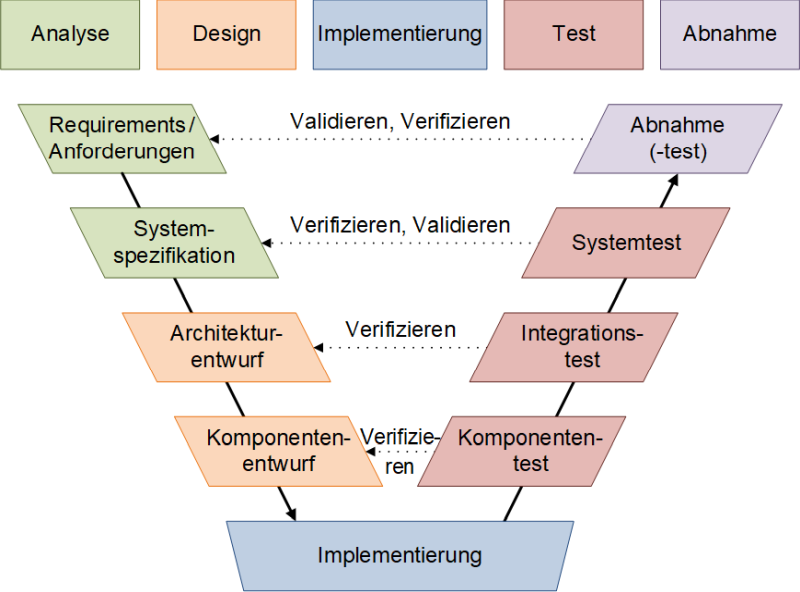

**Grundlagen zu Testing und Testing in Vorgehensmodelle**

## Lernziele

- Sie können Gründe für das Testen einer Applikation nennen
- Sie kennen den Unterschied zwischen einem Fehler und einem Mangel
- Sie können den Begriff Fehlermaskierung erklären
- Sie können erläutern, wieso ein vollständiges Testen nicht möglich ist
- Sie können die Kriterien für gute Testfälle erklären
- Sie kennen SW-Vorgehensmodelle und können diese beschreiben
- Sie können die Arten von Tests den jeweiligen SW-Vorgehensmodellen zuordnen

### Grund für Testing

Testing wird in der Softwareentwicklung eingesetzt, um die Qualität der Software zu verbessern und zu garantieren. Testing wird auch bereits vor der Softwareentwicklung in anderen Branchen eingesetzt.

### Fehler und Mangel

Fehler und Mangel sind zwei Begriffe, die in der Softwareentwicklung oft verwendet werden. Ein Fehler ist wenn die Ausführung nicht dem erwarteten entspricht und Mangel sind wenn die Ausführung nicht den Anforderungen entspricht.

### Fehlermaskierung

Fehlermaskierung ist wenn ein anderer Teil der Software ein Fehler verursacht. Dieser Fehler wird dann nicht mehr erkannt, da der andere Fehler diesen verdeckt.

### Vollständiges Testen

Vollständiges Testen ist nicht möglich, da es zu viele Kombinationen gibt. Es ist auch nicht möglich, alle möglichen Eingaben zu testen.

### Kriterien für gute Testfälle

- Aus Tests, welche eine hohe Wahrscheinlichkeit von Fehler aufzeigen
- Aus Tests, die nicht dasselbe testen (keine Redundanz)
- Aus Tests, die unabhängig von einander sind
- Aus Tests, die möglichst viel Code abdecken

### SW-Vorgehensmodelle

Das SW-Vorgehensmodell ist ein Modell, welches den Ablauf der Softwareentwicklung beschreibt. Das V Modell ist ein verbesserts Wasserfall Modell.

