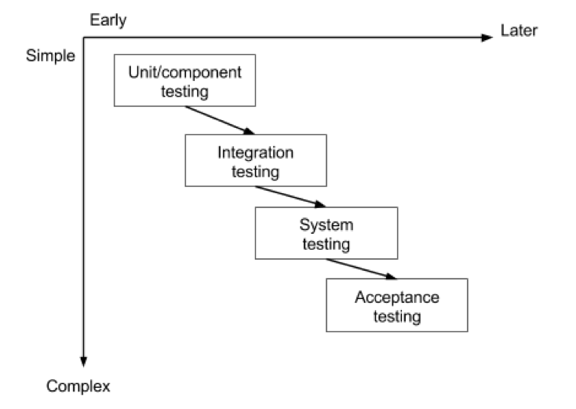

## Glossar:

| Abkürzung | Erklärung               |
| --------- | ----------------------- |
| Bug       | Software Fehler / Error |
| UAT       | User Acceptance Testing |
| QA        | Quality Assurance       |
| SLA       | Service Level Agreement |

## Lernziel:

- Ich kenne die verschiedenen Stufen von Testing
- Ich kenne die Reihenfolge dieser Stufen im Entwicklungs Prozess
- Ich kenne Begrifflichkeiten wie White-Box und Black-Box
- Ich weiss welche Stufen von welchen Rollen abgedeckt sind
- Sie kennen den funktionale und nichtfunktionale Anforderungen

## Testlevels:

**Ablauf der Testlevels:**

## White-Box vs. Black-Box:

**White-Box Testing**:
White-Box Testing ist eine Testmethode, bei der der Tester die interne Struktur, das Design und die Implementierung des Codes kennt. Der Tester wählt Testfälle basierend auf dem Code aus, um die interne Struktur des Programms zu testen. Es wird auch als Struktur-, Code- oder Glass-Box-Test bezeichnet.

**Black-Box Testing**:
Black-Box Testing ist eine Testmethode, bei der der Tester die interne Struktur, das Design und die Implementierung des Codes _nicht_ kennt. Der Tester wählt Testfälle basierend auf den funktionalen Anforderungen aus, ohne die interne Struktur des Programms zu kennen. Es wird auch als funktioneller, externer oder Spezifikationstest bezeichnet.
